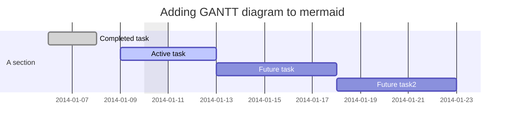

import { Mermaid } from 'mdx-mermaid/Mermaid';

```powershell
1..10 | ForEach-Object { Write-Host $_ }
```

```r
x <- c(1,2,3)
```

```python
for i in range(1):
  print(i)

```

```lua
while( true )
do
   print("This loop will run forever.")
end

```

```groovy
def a = new Map()

```

```groovy

process {} 

workflow {}
```


<Mermaid chart = { `
sequenceDiagram
    Alice->>John: Hello John, how are you?
    John-->>Alice: Great!
    Alice-)John: See you later!
`}/>

export const Highlight = ({children, color}) => (
  <span
    style={{
      backgroundColor: color,
      borderRadius: '2px',
      color: '#fff',
      padding: '0.2rem',
    }}>
    {children}
  </span>
);

<Highlight color="#25c2a0">Docusaurus green</Highlight> and <Highlight color="#1877F2">Facebook blue</Highlight> are my favorite colors.


<Mermaid chart={`sequenceDiagram
    participant Alice
    participant Bob
    Alice->>John: Hello John, how are you?
    loop Healthcheck
        John->>John: Fight against hypochondria
    end
    Note right of John: Rational thoughts <br/>prevail!
    John-->>Alice: Great!
    John->>Bob: How about you?
    Bob-->>John: Jolly good!`} />

I can write **Markdown** alongside my _JSX_!


